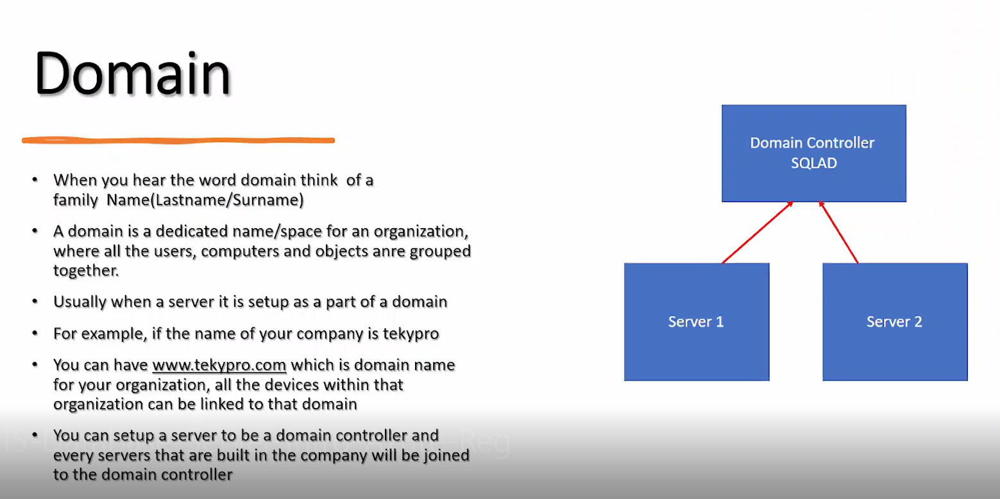
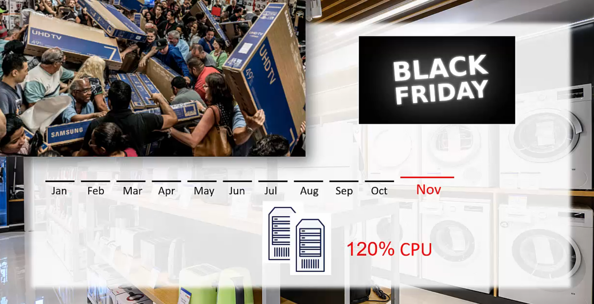
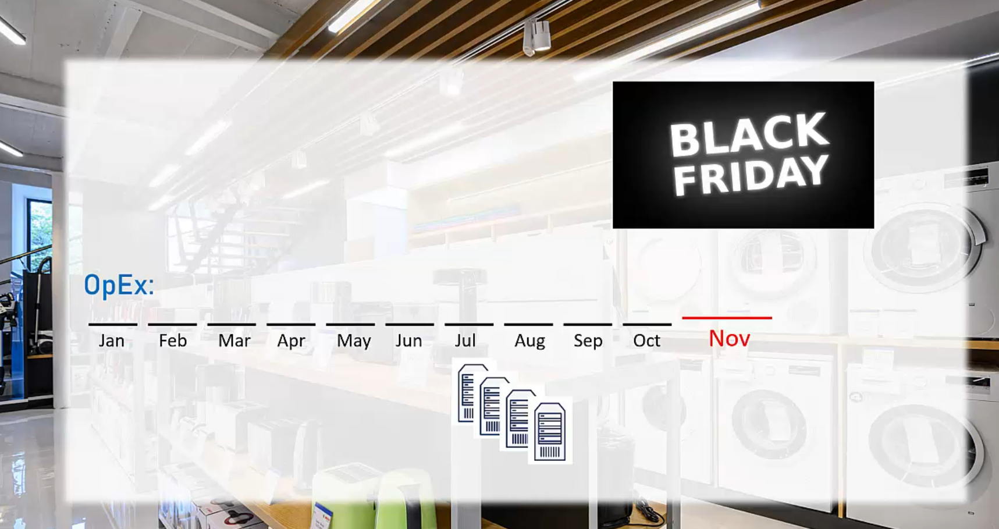

# DB-Administrator

<!-- 
<ins>text</ins>
<ins></ins>
-->

## Why Data
- Data is the number one valuable resource
- It is used to make inform Decision.

### Roles of Database Administrator

- Setup Database
- Backup and Restore
- Manage access and permission
- Secure Database Environments
- Performing tuning
- Upgrading and Migration
- Patching and Maintenance
- Code Deployments

<ins>Let's Get Technical</ins>
- Servers
- Virtual Machines (VMs)
- Domains
- Databases

## SERVER
- When you hear the word SERVER think of a computer
- A server just like your computer which made up of 
    - CPU / Processor => Central Processing Unit
    - Memory / RAM => Random Access Memory
    - Storage / Disk
- The bigger the specification the stronger the capacity

### VIRTUAL MACHINES (VMs) / SERVER
- In computing, a virtual machine is the virtualization / emulation of a computer system. 
- Virtual Machine are based on computer architectures and provide functionality of a physical computer. 
- Their implementations may involved specialized hardware, software

### Purpose of Virtual Machines(VMs) 
- Is to operate multiples operating system at the same time, from the same piece of hardware.

- Without Virtualization, operating multiple systems - like Windows and Linux - would require two separate physical units. 
- A virtual machine is also a server, so we will be using them interchangeably

### DOMAIN
- When you hear the word DOMAIN think of a family Name(Lastname/Surname)
- DOMAIN is a dedicated name / space for an organization, where all the users, computers and objects are grouped
- Usually when a server is setup as a part of a domain
- You can have www.tkennypro.com which is domain name for your organization, all the devices within that organization can be linked to that domain.
- You can setup a server to be a domain controller and every servers that are built in the company will be joined to the domain controller.

### Databases and Servers
- A database is an application that store Data 
-The Database Application / Software that lives inside a Server
- As a matter of fact, every application we work with today lives inside a server
- To SETUP A DATABASE you will need to first setup server

## INFRASTRUCTURE is where we keep our server 
- We can build INFRASTRUCTURE on PREM or in the CLOUD
- 1. ON PREM => Is when company setup and manages their own datacenter infrastructure
- 2. IN THE CLOUD => Is when we use cloud providers infrastructure instead of building or managing ours, it operates a pay as you go model like an hotel.

### Before the CLOUD
#### If you needed a SERVER, you had to:
- Buy it
- Install it
- Maintain it
- Replace it
- You have to have your own IT team

### You often ended up with this:
#### SERVER

### This same goes with: 
- Networking
- Databases
- User Management
- And more...

- But there is more...
#### Store

#### Website Jan-Oct-60%-sales

#### Website Jan-Oct-60%-120%-sales due to Black Friday

#### Website crash and burn simply website went down 

#### After you set up a meeting with the IT teams 

#### Discussion to increase the servers from 2 to 4 and then what happen, the website keep hold up 

#### Used server 

#### Wasted money used on unused server and this is the exact problem CLOUD try to solve

### CLOUD is a computer, networking, storage and other services managed by someone else in other to work properly

### CLOUD PROVIDERS 
- Companies who build huge data centers
- Fill it with servers, networking, cooling, electricity etc
- Design and install various services
- Make it publicly accessible

#### Data Center and this the smaller there are more bigger one 
#### This is how it looks outside

#### This is how it looks inside

### CLOUD SERVICES:
- Clouds are huge and the competition is fierce
- Offer a lot of additional services
- AI
- IOT
- Kubernetes
- And lots more...

### In the CLOUD era...
- If you need a server, you can:
  - Create it in the cloud within minutes
  - Use it as you wish
  - Pay for what you use
  - Shut it down when not needed
  - Automatically maintained, patched, secured, monitored

- Five characteristics of Cloud Computing
  - On-Demand Self Services 
  - Broad Network Access
  - Resource Pooling
  - Rapid Elasticity
  - Measured Service

- On-Demand Self Services:
  - No human interaction is needed for resources provisioning
  - Resource can be provisioned (created) with a click of a button
  - Provisioning is available 24/7

- Broad Network Access:
  - Resources can be accessed from anywhere using the network
  - Ideally high broadband
  - No physical access is required at any time

- Resource Pooling:
  - Physical resources are shared between customers
  - The cloud's backbone decides which physical resources to allocate for a customer's virtual services
  - Some advanced cloud services allow for physical resource separation

- Rapid Elasticity:
  - Resources can be scaled up and down as needed, automatically
  - No need to purchase resources for a one-time peak scenario

- Measured Service:
  - Payment is done only for resources actually used
  - Server time / DB storage / Function calls etc.
  - Measurement usually done in high-resolution
    - Server time by the second
  - No need to invest money in non-used resources

### TERMS WILL NEED TO KNOW
- CapEx: Capital Expense                                            
  - Making upfront investment for future use / profit
    - Non optimal
    - Not flexible

- OpEx: Operating Expense
  - Pay for what you actually use
    - Extremely flexible
    - Most optimal
- This is what w get with CLOUD    

### Traditional IT - is CapEx Oriented
- Major investment for:
  - Building data center
  - Purchasing servers
  - Purchasing air conditioning
  - Purchasing network devices
  - Purchasing software licenses (DB etc)
    - ...And only then - it can be used...

- Even though Traditional IT - is CapEx Oriented
  - There's also OpEx involved:
    - Electricity usually paid by the month
    - Salaries the IT guys every month
    - Maintenance
    - And more...

#### CapEx - Capital Expenses

#### CapEx - Operating Expenses

- Buy two server at beginning and then w let them run until Sales period November preparing for Black FRIDAY add two more Server and can be decrease again to the number of server back to two. Only two more in November
