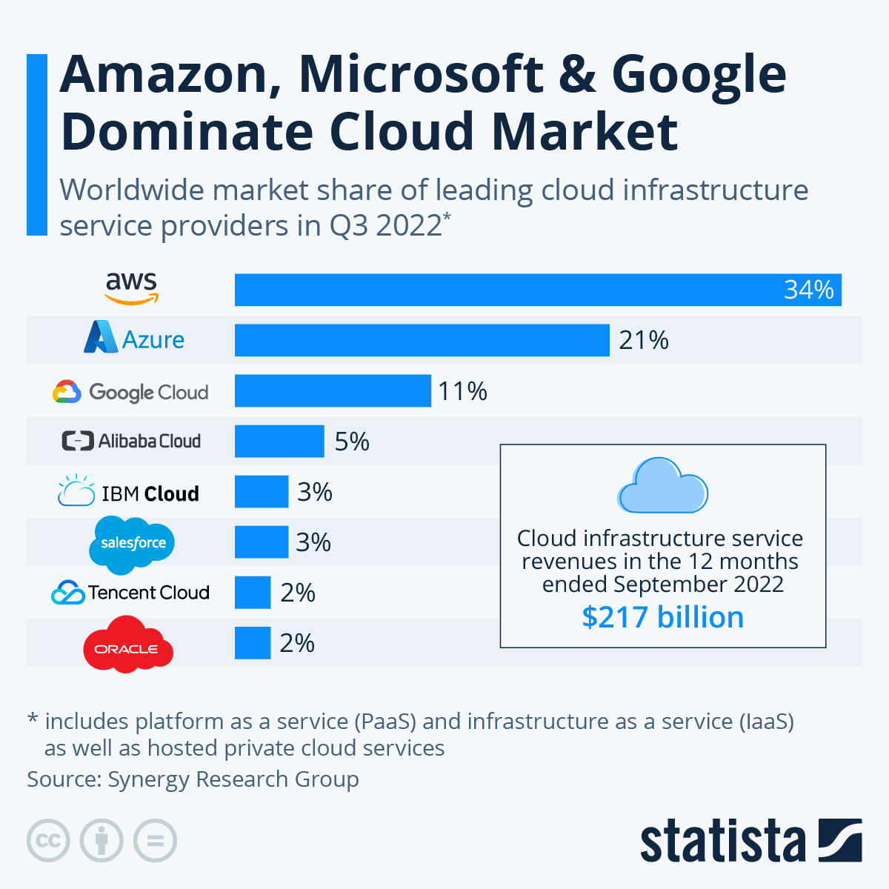

<!-- 
<ins>text</ins>
<ins></ins>
-->

## Why Data
- Data is the number one valuable resource
- It is used to make inform Decision.

### Roles of Database Administrator

- Setup Database
- Backup and Restore
- Manage access and permission
- Secure Database Environments
- Performing tuning
- Upgrading and Migration
- Patching and Maintenance
- Code Deployments

### Various Database Roles 

<ins>Let's Get Technical</ins>
- Servers
- Virtual Machines (VMs)
- Domains
- Databases

## SERVER
- When you hear the word SERVER think of a computer
- A server just like your computer which made up of 
    - CPU / Processor => Central Processing Unit
    - Memory / RAM => Random-Access Memory
    - Storage / Disk
- The bigger the specification the stronger the capacity

### VIRTUAL MACHINES (VMs) / SERVER
- In computing, a virtual machine is the virtualization / emulation of a computer system. 
- Virtual Machine are based on computer architectures and provide functionality of a physical computer. 
- Their implementations may involved specialized hardware, software

### Purpose of Virtual Machines(VMs) 
- Is to operate multiples operating system at the same time, from the same piece of hardware.

- Without Virtualization, operating multiple systems - like Windows and Linux - would require two separate physical units. 
- A virtual machine is also a server, so we will be using them interchangeably

### DOMAIN
- When you hear the word DOMAIN think of a family Name(Lastname/Surname)
- DOMAIN is a dedicated name/ space for an organization, where all the users, computers and objects are grouped
- Usually when a server is setup as a part of a domain
- You can have www.tkennypro.com which is domain name for your organization, all the devices within that organization can be linked to that domain.
- You can setup a server to be a domain controller and every servers that are built in the company will be joined to the domain controller.

### Databases and Servers
- A database is an application that store Data 
-The Database Application / Software that lives inside a Server
- As a matter of fact, every application we work with today lives inside a server
- To SETUP A DATABASE you will need to first setup server

## INFRASTRUCTURE is where we keep our server 
- We can build INFRASTRUCTURE on PREM or in the CLOUD
- 1. ON PREM => Is when company setup and manages their own datacenter infrastructure
- 2. IN THE CLOUD => Is when we use cloud providers infrastructure instead of building or managing ours, it operates a pay as you go model like an hotel.

### Before the CLOUD
#### If you needed a SERVER, you had to:
- Buy it
- Install it
- Maintain it
- Replace it
- You have to have your own IT team

### You often ended up with this:
#### SERVER

### This same goes with: 
- Networking
- Databases
- User Management
- And more...

- But there is more...
#### Store

#### Website Jan-Oct-60%-sales

#### Website Jan-Oct-60%-120%-sales due to Black Friday

#### Website crash and burn simply website went down 

#### After you set up a meeting with the IT teams 

#### Discussion to increase the servers from 2 to 4 and then what happen, the website keep hold up 

#### Used server 

#### Wasted money used on unused server and this is the exact problem CLOUD try to solve

### CLOUD is a computer, networking, storage and other services managed by someone else in other to work properly

### CLOUD PROVIDERS 
- Companies who build huge data centers
- Fill it with servers, networking, cooling, electricity etc
- Design and install various services
- Make it publicly accessible

#### Data Center and this the smaller there are more bigger one 
#### This is how it looks outside

#### This is how it looks inside

### CLOUD SERVICES:
- Clouds are huge and the competition is fierce
- Offer a lot of additional services
- AI
- IOT
- Kubernetes
- And lots more...

### In the CLOUD era...
- If you need a server, you can:
  - Create it in the cloud within minutes
  - Use it as you wish
  - Pay for what you use
  - Shut it down when not needed
  - Automatically maintained, patched, secured, monitored

- Five characteristics of Cloud Computing
  - On-Demand Self Services 
  - Broad Network Access
  - Resource Pooling
  - Rapid Elasticity
  - Measured Service

- On-Demand Self Services:
  - No human interaction is needed for resources provisioning
  - Resource can be provisioned (created) with a click of a button
  - Provisioning is available 24/7

- Broad Network Access:
  - Resources can be accessed from anywhere using the network
  - Ideally high broadband
  - No physical access is required at any time

- Resource Pooling:
  - Physical resources are shared between customers
  - The cloud's backbone decides which physical resources to allocate for a customer's virtual services
  - Some advanced cloud services allow for physical resource separation

- Rapid Elasticity:
  - Resources can be scaled up and down as needed, automatically
  - No need to purchase resources for a one-time peak scenario

- Measured Service:
  - Payment is done only for resources actually used
  - Server time / DB storage / Function calls etc.
  - Measurement usually done in high-resolution
    - Server time by the second
  - No need to invest money in non-used resources

### TERMS WILL NEED TO KNOW
- CapEx: Capital Expense                                            
  - Making upfront investment for future use / profit
    - Non optimal
    - Not flexible

- OpEx: Operating Expense
  - Pay for what you actually use
    - Extremely flexible
    - Most optimal
- This is what w get with CLOUD    

### Traditional IT - is CapEx Oriented
- Major investment for:
  - Building data center
  - Purchasing servers
  - Purchasing air conditioning
  - Purchasing network devices
  - Purchasing software licenses (DB etc)
    - ...And only then - it can be used...

- Even though Traditional IT - is CapEx Oriented
  - There's also OpEx involved:
    - Electricity usually paid by the month
    - Salaries the IT guys every month
    - Maintenance
    - And more...

#### CapEx - Capital Expenses

#### CapEx - Operating Expenses

- Buy two server at beginning and then w let them run until Sales period November preparing for Black FRIDAY add two more Server and can be decrease again to the number of server back to two. Only two more in November

### TYPES OF CLOUD SERVICES
- IaaS - Infrastructure as a Service
- PaaS - Platform as a Service
- SaaS
-----------------------------------
- IaaS 
- Infrastructure as a Service
   - The cloud provides the underlying platform
     - Compute
     - Networking
     - Storage
   - The client handles, and is responsible for all the rest

- Most common examples of IaaS: 
- virtual Machines 
  - The cloud provides the host machine, networking and disks
  - The client creates the virtual (guest) machine, installs software on it, patches it, maintains it etc. and cloud has nothing to do with it.

- PaaS
- Platform as a Service
  - The cloud provides platform for running apps
  - Including: Compute, networking, storage, runtime environment, scaling, redundancy, security, updates, patching, maintenance etc.
  -  The client just needs to bring the code to run

- Most common examples of PaaS: 
- Web Apps
  - The cloud provides the runtime for running web apps
  - The client uploads the code, and it just runs
  - The client has no access to the underlying virtual machines, its the responsibility of cloud to make sure the apps running

- SaaS 
- Software as a Services
  - A software running completely in the cloud
  - The user doesn't need to install anything on-premises or on his machine
  - The provider of the software takes care of the updates, patches, redundancy, scalability etc.

- Most common examples of SaaS:
- Office 365
- Salesforce

#### Types of Service

### Additional Service Types
- FaaS    ->   Functions as a Service
- DBaaS   ->   Database as a Service
- DaaS    ->   Desktop as a Service
- IOTaaS  ->   IOT as a Service
- AlaaS   ->   AI as a Service

### Types of CLOUDS
- Public
- Private
- Hybrid

####  Public
- The cloud is set up in the public network
- Managed by large companies
- Accessible through the internet
- Available to all clients and users
- Clients have no access to underlying infrastructure
#### Examples of Public Cloud
- AWS
- AZURE
- GOOGLE CLOUD
- IBM CLOUD
- ORACLE CLOUD 
- ALI CLOUD

### Private
- A cloud set up in an organization's premises
- Managed by the organization's IT team
- Accessible only in the organization's network
- Available to users from the organizations
- Uses private cloud infrastructure and engines
- Contains a subset of the public cloud's capabilities 

### Hybrid
- A cloud set up in an organizations premises...
- ...but also connected to the public cloud
- Workload can be separated between the two clouds
- ie. Sensitive data in the organizations premises eg Username, Password, Credited cards stored in the organizations premises and public data in the public cloud eg Profession profile like the one in the LINKEDIN can be stored in public cloud
- Usually managed by the public cloud, but not always the case sometimes other way round

### CLOUD PROVIDERS
- Are companies which build DATA-CENTERS and provide public cloud services
   - IaaS, PaaS, SaaS
   - Other services 

### MAIN CLOUD PROVIDERS

- LEADERS
  - Amazon Web Services
  - Microsoft with Azure
  - Google with (GCP) Google Cloud Platform
    - Visionaries

- CHALLENGES
  - ALIBABA CLOUD
  - ORACLE
  - IBM
  - TENCENT CLOUD
    - Niche Players 

### CLOUD PROVIDERS GROWTH
### CLOUD PROVIDERS GROWTH

# AZURE
- Microsoft's public cloud
- Announced in October 2008
- Released in February 2010
- The 2nd largest public cloud
- Closing the gap...

### Very important to know
- First focused on Platform as a Service (PaaS)
   - To counter AWS's IaaS focus
- Later added IaaS
- Currently offers the largest variety of cloud services

- Major clients:
   - BOEING
   - EBAY
   - SAMSUNG
   - BMW

## REGIONS
- The-full-list-of-Paired-Region-in-Azure
#### https://docs.microsoft.com/en-us/azure/best-practices-availability-paired-regions
- Microsoft build a lot of DATA-CENTERS for azure
- Each DATA-CENTERS location is called REGION
- There are ~60 Azure Regions (more than any other cloud)
- Almost every new resource in the cloud should be allocated to a region

## ZONES 
- Some of the regions have more than one physical DATA-CENTER
- Great for availability in case one DATA-CENTER fails
- Each DATA-CENTER is ZONE
- When there are more than one DATA-CENTER in a region, the region is said to have AVAILABILITY ZONES
- Some cloud services benefit from AVAILABILITY ZONES

## PAIRED REGIONS
- Some regions have design pair region
- For increased availability
- When a full region fails - the other one can fill its place
- Relevant for some of the cloud services
- Pairs are set by AZURE and cannot be changed

# AZURE SERVICES
### https://azure.microsoft.com/en-us/products/
- Everything that can be done in the is CLOUD SERVICE
- ie. Creating VMs, building databases, set up networks, use AI algorithms, using central user management etc.

# CREATING ACCOUNT
#### https://azure.microsoft.com/en-us/
- NOTE: 
  - NEEDED FOR FREE ACCOUNT OF $200 FOR ONE MONTH
  - Valid Credit Card
  - Mobile Phone
- Click Free Account 
- Start Free - Create one!
- Email Address that is not in a Microsoft Account
- Password
- Country
- DOB
- Verify email - Fill in with code sent to you
- Next
- Make sure you are a person - Just answer the correct one
- Next
- Your Profile - Fill in the details watch out for the required one with exclamation Mark(!)
- Next
- Identify verification by phone
- Text Me - verify code
- Credit card - No charges just to authorize it, fill in
- Next 
- Agreement - Check the 2 box
- Sign Up - Wait for the account to be set up
- Great - You're ready to start with Azure

## BUILD IN THE PORTAL
- Create resources
- Remove resources
- Status of the portal

  - Subscription
    - Logical Container
       - Contains the various resources you provision in the cloud (VMs, DBs, networks etc.)
       - Can be attached to a lot of accounts. for create VMs, DBs

  - Account
    - Identify 
       - An identity with access to resources in the subscription (ie. You)
       - Can be attached to a lot of subscription

## CREATING RESOURCES
## https://portal.azure.com/#home
- Resource groups
- Click Add button
- Project Details - Azure subscription 1
- Resource group - my-rg just any name you like
- Region - A specific region
- Review + create
- Summary of the created resource group

- Click Create
- Click the my-rg to open the resource group page
- Congrats

## Findings the Resource
- Search Bar - Shows recent resources
- Or type my-rg, shows below the Resource Groups
- Click

## Removing a Resource 
- Click on the Delete resource group
- Type the name of the resource group 
- Click delete and see the notification that the resource group has been deleted

## Azure CLI Bash & PowerShell
### Bash - black bg
- Click on the COMMAND SHELL(CLI) - can be used same as portal
- Click Bash
- Click Create Storage - lets type this command
- az group create -l westus -n CLITest-rg -- case sensitive CLITest-rg
- Click ENTER

### Powershell - blue bg
- New-AzResourceGroup -Name PSTest-rg Location westus -- same as bash command above

## Selecting Regions
- Almost every resource in AZURE should be placed in a REGION 
- How to SELECT REGION - Factors that influence select for our resources
   - Geographical proximity to system's audience choose the one that is closest to the audience
   - Services availability - Not every Azure service is available in all the regions
   - Availability Zone - check not just one in case one fails another can one can pick up
   - Pricing - is another factor like Norway-west side is high and westus is cheaper

## RESOURCE GROUPS
     - Is a logic container for resources 
     - Is used for grouping resources by a logic boundary
     - Free you can create as many group as you want
- REASONS OF USING RESOURCE GROUP
     - Contain all development groups / Test resources / Production resources
     - Team A resources ie separate resource group by team every team w have is resource in resources group
     
### Resource Groups vs Subscription
  - Subscription
    - Logical Container
       - Contains the various resources you provision in the cloud (VMs, DBs, networks etc.)
       - Can be attached to a lot of accounts. for create VMs, DBs

## Resource Groups Naming Conventions
- It's best practice to have an "rg" or "RG" as part of the resource group name
- Cold be prefix or suffix
- RG-Project-Dev
- Finance-Resources-rg

## Resource Groups
- Almost every resource in AZURE is placed in a Resource Group
- Need to specify where it we be located

## Creating a virtual machine
- Search bar type Virtual Machine
- Click Virtual Machine 
- Click Add
- Virtual Machine
- Page - Creating a virtual machine

## Storage Account
- Used to store almost anything in Azure
- Used transparently by various services
- For example: 
     - Database backups
     - VM Disks
     - Diagnostics data
     - Used also for explicit data storage

## SLA - Service Level Agreement
- Basically define as the uptime % annually of cloud service

- ALWAYS checks the SLA of the service used

#### Get the latest
#### https://uptime.is/

## SLA Calculation
- To get the actual system SLA, multiply the SLAs of the participating services
- Example
- App Service SLA = 99.95%
- Azure SQL SLA = 99.99%
- NOW TO GET ACTUAL SLA
- Actual SLA = 99.95 X 99.99 = 99.94% = 5h 12m 59s annual downtime
- It also depend on system requirement

#### https://uptime.is/

## COST
- Almost everything in the cloud costs money
- Few pricing models: 
    - Per resource(ie. VM)
    - Per consumption (ie. Function Apps)  
    - Reservations

- RULES
    - Always check resource's cost before provisioning
    - Check for reservations when available and relevant
  
## SETTING BUDGET 
- Cost management + Billing
- Click Cost Management
- Click Budget
- Click Add
- Budget Details
- Name - close-to-200
- Reset Period - Annual
- Amount 200
- Next
- Alert Condition 
   - % Of budget - 90% (which $180 of the budget)
- Alert recipients (email)  add email
- Language - English or any you like
- Create
- Now check Budget of left side, right there is the BUDGET

## ARCHITECTS AND THE CLOUD
- Software Architects designing regular system need to know:
    - Non-Function Requirements
    - Technology Stack
    - Component's Architecture 
    - Communication Patterns
- Cloud-based systems require, in addition:
    - Infrastructure knowledge
    - Security
    - Hands-on ie great knowledge/experience about cloud because no one else know about it

### COMPUTE
- Is set of cloud services for hosting and running applications
- Allows uploading your code and the running it
- Offers various levels of control and flexibility 

### Four Types of COMPUTE services:
- Virtual Machines
- App Services
- AKS
- Azure Functions

### Virtual Machines 
- A virtual (not real) server running on a physical (real) server
- Allows creating new servers extremely quick
- Based on existing resources of the physical server
- From the user's point of view - a regular server, nothing new
- Called an Unmanaged Service

## Virtual Machines Architecture

## How it work in AZURE

## Steps for creating VM in AZURE:
- Selecting the location
- Select the image(OS + Pre-Installed software) base on the operating system 
- Select the size (CPU & RAM/MEMORY)
- Don't forget to check the price! pick the most efficient cost effective Virtual Machine

## The Real Cost of Virtual Machine(VM)
- Cost of VM includes:
    - VM
    - DISK
    - IP
    - Storage

## REDUCING THE COST OF VM
- Most effective techniques to reduce costs of VM:
    - Auto Shutdown
    - Reserved Instances
    - Spot Instances
    - Disk Optimization

### Auto Shutdown
- Automatically shuts down the machine when not needed
    - Relevant mainly for test / dev machines
- Storage and IP(if static) costs still incurred
- Can save >50% of VM cost

### Reserved Instances
- Allow upfront payment with substantial discount
- Usually offered for 1 or 3 years
    - Great for production machine which run continuously 
- Offers great discounts (up to 62%)
- Can be divided to monthly payments
- Can not be stopped / refunded

### Spot Instances
- Machines that run on unused capacity in Azure
- Can be evicted any moment when needed by Azure
- Offers up to 90% discount, price fluctuates according to demand
- Great for non-critical, non-continuous tasks
    - ie. Batch processes, long running calculations

### Disk Optimization
- Make sure to select the right disk for the machine
- Default is premium SSD - the most expensive option
- Non IO-intensive machines can do with Standard SSD
    - ie. App servers, in-memory cache
- Note: Disk type affects the SLA (Service Level Agreements)

### More Cost Saving Techniques
- Select the right size for your machine
    - CPU should not rest, you pay for it
- Select Linux over Windows when possible
- Check price in nearby regions

## Availability of a VM

## Availability Concepts in Azure
- Fault Domain - Physical Hardware is Rack
- Update Domain
- Availability Set
- Availability Zone

### Fault Domain
- Logical group of physical hardware that share a common power

### Update Domain
- Logical group of physical hardware that can undergo maintenance and be rebooted at the same time
- Maintenance is done by Azure at its own discretion

### Availability Set
- A collection of Fault Domains and Update Domains your VMs will be spread across
- Can contain up to 3 Fault Domains and up to 20 Update Domains
- All domains (Fault & Update) are in the same Zone (=datacenter)

### Taking Advantage of Availability Set
- Deploy identical VMs into the same Availability Set
- Ensures they won't be shut down simultaneously when a single fault domain shut down or an update domain reboots
- If needed - deploy load balancer to route between the VMs
- Availability Set is free, you pay only for the additional VMs

### Availability Zone
- A physical separate zone within an Azure region
- Technically - a building containing an autonomous data center
- Each zone functions as a fault & update domain
- Provides protection against a complete zone shutdown
   - Hence the better SLA(Service Level Agreements)

### Taking Advantage of Availability Zone
- Deploy identical VMs into separate Availability Zones in the same Region
- Ensures they won't be shut down simultaneously when the Zone shuts down
- If needed - deploy load balancer to route between the VMs
- Availability Zone is free, you pay only for the additional VMs

## ARM Template
- Azure Resource Manager Template
- A JSON file describing the resource(s) to be created
- Used by Azure in (almost) all deployments

#### Resource Group is a holder where you organize all your document everything w create in Azure 

- Set the ip address to point to SQLAD
- We want to join the SQL01 to the domain

- Microsoft SQL Server
#### LATEST
- SQL server 2022
- SQL server 2019 
- SQL server 2017 
- SQL server 2016

- SQL server 2014 ---2014 TO INSTALL because the process looks the same for the below version

#### LEGACY and Microsoft no longer support them
- SQL server 2012 
- SQL server 2008R2 
- SQL server 2008
- SQL server 2005 

- Install SQL server on SQL01

- .netframework 3.5
- Go to your server manager 
- Go to Dashboard
- Add roles and features - next - next

### Options in installing SQL server
- Default instance
- Named instance

# DATABASE ADMINISTRATION MSSQL

### Database Samples
- https://www.db-fiddle.com/
- https://github.com/Microsoft/sql-server-samples/releases/tag/adventureworks 
- https://github.com/Microsoft/sql-server-samples/releases/tag/wide-world-importers-v1.0
- https://github.com/Microsoft/sql-server-samples
- https://mindmajix.com/sql-server-dba-interview-questions
-https://www.sqlshack.com/sql-server-dba-interview-questions-and-answers/
- https://www.interviewkickstart.com/interview-questions/sql-server-dba-interview-questions

<!-- 
<ins>text</ins>
<ins></ins>
-->

# <ins>Database</ins>
## <ins>Database</ins> is a collection of data and also a method for us to access and manipulating data, database are not anything special they are just hardware and software, there is just computers

## <ins>Database</ins> is a collection of data and a method of accessing and manipulating (SQL) of that data.

## <ins>Database</ins> is a system, hardware and software that allows a user to store, organize and use data

## What we will learn

- How to put data in DATABASE
- How to use/update/learn from data
- How to remove data

## Confusing Acronyms

- DataBase Management System (DBMS) => Is a software, its a program that is used to manage the database. It receives instructions from somebody like us that wants something to do with data and instructs the system, the database to make this to actually grab the data or make changes to the data

- Relational DataBase Management System (RDBMS) => This is a subset of database management system, what we are going to learn about is something called relational database, and they are the most used, the most common, the most popular type of databases. And the most useful things like MySQL, PostgreSQL, Microsoft Server SQL , Oracle, all use this relational database management system and its same thing as a DBMS is just more specific, saying , hey, this uses a relational database model

- Structured Query Language (SQL) => Its a way for us to interact with a database management system

## Database Model
- Database Model serves as the model (or template) for all databases created on the same instance. If the model database is modified, all subsequent databases created on that instance will pick up those changes, but earlier created databases will not. Note that TEMPDB is also created from the model every time SQL Server starts up.

- Relational Model - E-commerce, Businesses
- Document Model - Scalability
- Key Value Model - retests at CD or Dynamo DB
- Graph Model - Social network 
- Wide Columnary Model  

- TYPES OF SQL DATA FILE
    
      1  MDF => MASTER DATABASE FILE = Primary data file with actual data.
      2  LDF = LOG DATA FILE = Contains transaction logs activities on MDF.

- System Database uses 4 folder to manage itself

      => master => is the master database which keeps track of system settings, : is  the brain of the SQL Server instances, it stores importation information ( Metadata) about your sql server, if the master database is corrupt your sql server will not start
         •	file locations of the user databases
         •	login accounts
         •	server configuration settings
         •	linked servers information

      => model  => is used as template for all databases that w are going to create, it’s a template database for Newly created database on the server
         •	A template database that is copied into a new database 
         •	Options set in model will be applied to new databases
         •	Used to create tempdb every time the server starts  

      => msdb   => is used scheduling tasks, it stores important information about your sql agent, jobs database mail and profile
         •	Support SQL Server Agent
         •	SQL Server Management Studio
         •	Database Mail
         •	Service Broker
         •	History and metadata information is available in msdb
         •	Backup and restore history for the databases
         •	History for SQL agent jobs

      => tempdb => is used as temporary storage location that SQL use when performing large number calculation or when moving records around in other databases, is used for temporary objects
         •	The tempdb is a shared resource used by SQL Server all users 
         •	Tempdb is used for temporary objects, worktables, online index operations, cursors, table variables, and the snapshot isolation version store, among other things
         •	It is recreated every time that the server is restarted
         •	As tempdb is non-permanent storage, backups and restores are not allowed for this database.  
    
#### What is SQL SERVER
- Microsoft SQL Server is a relational database management system (RDBMS) developed by Microsoft.
- Is use to store and retrieve data requested by application
- Runs mainly on Windows environment but now runs on Linux environment too
- SQL Server can be installed as remote server on dedicated server or locally on your computer

- An SQL Server installation is called an INSTANCE. Multiple instances can be installed on same machine.
- Structured Query Language (SQL) is used to interact with RDBMS.
- Microsoft's own implementation of SQL is called TRANSACT-SQL (T-SQL)

### HARDWARE AND SOFTWARE REQUIREMENTS 
- Table => Is a collection of columns and rows in which each column has a specific data in it and is a database created by SQL Server to stores data inside tables.
- A table is a collection of related data held in a table format within a database.
- A table consists of columns (fields) and rows (records).
- Each table in a database holds data about a different, but related, subject.

### SQL Server DataTypes

- Selecting the right data type to store your data is very important and must consider the following point below
  - Maximize storage capacity
  - Make allowance for growth
  - Decrease network traffic
  - Protect data integrity
  - Try to pick the smallest data type to fit the type of data you want to store.

- Datatype is defined as the type of data which any column or variable can store in MS SQL Server.

- Tables is a collection of columns and rows and each column has specific data that it wants to store

### COLUMNS
- Collection of COLUMN is called DEGREE e.g the degree of the relation is ID, lastName, firstName, sex, and date of birth and each and every column stores a specific type of data

DOMAIN or CONSTRAINT => is what we called what a column can store i.e in dob only constraint date and sex only constraint m/f

- Tables consist of columns/attributes and rows with specific data

- Table has much more NUANCE means There is a lot more details there

### ROWS

- ROWS => can also be called TUPLE/ROWS so one TUPLE is singular row of data, TUPLES are multiple rows of data 

- Each and every one of TUPLES follows the column constraints 

- CARDINALITY is a multiples of TUPLE/ROWS all of the data that is in the table rows

- NULL / EMPTY Values is any piece of information that is blank or unknown that does not have a value yet
-- CHECKING FOR EMPTY VALUES = WHEN THE RECORDS DOES NOT HAVE A VALUE IT IS CONSIDERED EMPTY
- WHEN USING NULL

      BE CAREFUL
      BE MINDFUL
      BE DELIBERATE
      BE DEFENSIVE that is always check for NULL when its necessary

- Think of the following before using NULL  

      OPTIONAL OR REQUIRED?
      FUTURE INFO?
      RATIONAL?
      select Null = null == <NULL>

### What makes the RELATIONS MODEL => Is the ability to link relationships between different types of data table 

- Primary Key is a key or something that uniquely identifies your data which is used to identify each row.

- Foreign Key is just other terminology and is a key that will reference the primary key, the unique identifier of a different table therefore allowing a relationship to be formed.

### Function 
- Function is a set of steps that creates a single value and also is something that takes an input and generates an output

### Types of Functions

- AGGREGATE FUNCTION / AGGREGATE DATA = Operate on many records to produce single value. Take all the data, take everything and produce one single value, produce summary, for example calculate all salary

- Aggregate Functions 
     
       AVG()  
     
       COUNT()
     
       MIN()
     
       MAX()
     
       SUM()

- SCALAR FUNCTION operate on each record independently in row against each row. 

- Importing Data into CSV file
- CSV file => Comma separated value

- Table - Standard Table which only shows the current state of data and each table can only contain one primary key
- Memory Optimized Table - Store data in system memory as well as on a Disk which is fast to read and write to
- Temporary Table - Maintain Date and TimeStamps for every change made to the data which will allows us to essentially look back in time and see the state of data as it was at any time and REGULAR TABLE don't include this capability.
- Graph Table - Are structured differently than table that follows the relational model of storing data and store things called NODE TABLE and EDGE TABLE which are used to define a web interconnected relations
- External Table - This are connecting to ADOBE and ADOBE is a known SQL Database type and also for blulb storage locations 
- File Table - Are for storing files inside the SQL Server databases

- The NVARCHAR data type stores character data in a VARIABLE-LENGTH field.
- Data can be a string of single-byte or multibyte letters, digits, and other characters that are supported by the code set of your database locale.

- NVARCHAR stores UNICODE data. If you have requirements to store UNICODE or multilingual data, NVARCHAR is the choice.

- FLAT FILE SOURCE - Reads data from a text file. The text file can be in delimited, fixed width, or mixed format.
- DELIMITED FORMAT uses column and row delimiters to define columns and rows. 

- FLAT FILE => Refer to data that contain records with no structure relationship and may also contains basic formatting. Example is a CSV file

- CREATING AN IDENTITY COLUMN
- IDENTITY COLUMN  is a unique column that automatically generates a numeric sequence when a new record is added to the database table.
- They create a unique identifier for things like driver's license, social security numbers account number, medical records number etc.

- IDENTITY SEED is the starting value assigned to the first record in the column.The default is 1 but you can set it to what you like.

- IDENTITY INCREMENT is the value you choose to increase the starting value set by the IDENTITY SEED. The default value is 1 but you can change it.

- PRIMARY KEYS (PK) is a column or a group of columns that uniquely identifies each row in a table and each table can contain only one PRIMARY KEY
- All columns that participate in the PRIMARY KEY must be defined as NOT NULL.

- INDEX = An index contains keys built from one or more columns in the table or view (virtual table). These keys are stored in a structure that enables SQL Server to find the row or rows associated with the key values quickly and efficiently.

- CLUSTERED INDEXES = Defines the holder in which data is physically store in a table 
- CLUSTERED INDEXES sort and store the data rows in the table or view based on their key values.

NONCLUSTERED INDEX => Does not sort the physical data inside the table column
NON CLUSTERED INDEX => contains the nonclustered index key values and each key value entry has a pointer to the data row that contains the key value and does not sort the data in the table column

### SETTING DEFAULT VALUE
- DEFAULT VALUE is used to provide a default value for a column. eg Country if all records are from one country, TimeStamp
- The DEFAULT VALUES set will be added to all new records if no other value is specified.

- TIMESTAMP => Data Type => datetime2(7) the (7) is the fractional seconds precision is OPTIONAL. It ranges from 0 to 7. 
- PRECISION is the number of digits in a number.

- The storage size of a DATETIME2 value depends on the FRACTIONAL SECONDS PRECISION. It requires 6 bytes for the precision that is less than 3, 7 bytes for the PRECISION that is between 3 and 4, and 8 bytes for all other PRECISIONS.

- In most computer systems, a BYTE is a unit of data that is EIGHT BINARY DIGITS LONG. A BYTE is the unit most computers use to represent a characters such as a letter, number or typographic symbol.

- GETDATE() is a function that returns the current DATE AND TIME from the system on which the SQL  Server is installed / running.

- CHECK CONSTRAINT => The check constraint in SQL SERVER allow you to specify a condition on each row in a table its used to limit the value range that can be place in a column.It will only allow data values that meet the requirements that you specified.

- Using CHECK CONSTRAINT => Provides the level of data validation to ensure that the information that is getting to store into your database meet your expectation and business rules on check constraint.

- LEN() function returns the number of characters of an input string(sequence of characters) eg Len(LastName)>=2 it will check if the length of FirstName is greater than or equal to 2 and once the characters is less than 2 it will not allow you to set the records
        
      - Expression     Len(LastName)=>2
      - (Name)         CK_Guests_LastNameLength 
      - Description    Verifies that lastname is longer than two characters

- UNIQUE CONSTRAINT => Allows you to ensures that the data stored in a column, or a group of columns, is unique among the rows in a table. 

- FOREIGN KEY is a field (or collection of fields) in one table that refers to the PRIMARY KEY in another table
-The TABLE containing the FOREIGN KEY is called the CHILD TABLE, and the table containing the CANDIDATE KEY is called REFERENCED OR PARENT TABLE.

- A FOREIGN KEY is a key basically used to link two tables together.
- i.e We are able to reference data from another column in another table with FOREIGN KEYS. 

### CREATING RELATIONSHIP BETWEEN TWO TABLES

- First we need to formalize the relationship between the tables so that it can be recognize by the database engine this will enables SQL Server to follow the tread between the tables so that w don't have to manually look up to the values from one table to another table, the relationship is established on the FOREIGN KEY side of the relationship 

### Four basic Operation that are mostly performed on a database system
### What is CRUD
-        Create    : Create objects like database and tables
-        Read      : Retrieve and read records from database
-        Update    : Update existing records inside a database
-        Delete    : Delete records from the database

  
- SQL => Structured Query Language
- SQL lets you communicate and manipulate databases
- SQL is an ANSI(American National Standards Institute) standard
- There are different versions of the SQL Language e.g Oracle, Microsoft SQL Server
- To be compliant with ANSI all versions must support the following the same way:
- SELECT, UPDATE, DELETE, INSERT, WHERE this are important keyword in SQL

### What can be done with SQL
- Execute queries against a database
- Retrieve data from a database
- Insert records in a database
- Update records from a database
- Delete records from a database
- Create new tables in a database
- Create views in a database

### What is T-SQL(tee sequel)
-     Transact-SQL (T-SQL) is Microsoft SQL Server's implementation of the standard SQL
-     Transact-SQL (T-SQL) has it's own proprietary extensions in addition to the SQL standard.
-     Used to perform actions on a SQL Server database
-     Create new databases, tables and other objects.
-     Add user accounts, modify and manage access permissions.
-     Run maintenance tasks
-     Query database: retrieve data, Insert records, update records, delete records from a database
-     Create stored procedures in a database

- Click => New Query 
- Click => Tools => Options => Text Editor => All Languages => checked option => Line numbers = in other to get line number in your NEW QUERY.
- CREATE DATABASE DatabaseName;
- Type on Line Number 1 => CREATE DATABASE YourDB;
- Name of database must be unique within your SQL Server instance and must have a maximum of 128 characters.
- Click EXECUTE to Execute the Query or f5 on keyboard will also execute your query or right click and then EXECUTE 
- Refresh and extend your database to see the newly database created

### Query means instructions also known as SQL statement
#### Identifier is just a different word for a part of the data

      SELECT NAME
      FROM USERS
      WHERE ROLE = 'MANAGER';

### Create a new Table Using Transact-SQL (T-SQL)
        USE YourDB 
        GO
        
        
        CREATE TABLE dbo.Products
            (ProductID int PRIMARY KEY NOT NULL,
        	ProductName varchar(25) NOT NULL,
        	Price money NULL,
        	ProductDescription varchar(max) NULL )
        GO

- GO => The Go keyword separate statements when more than one statement is submitted in a single batch. GO is optional when the batch contains only one statement.
- dbo => Means DATABASE OWNER

- SQL script is a set of  SQL Commands saved as file with .sql extension.
- A script can contain one or more SQL Statements.

### Insert Data into Table Using Transact-SQL (T-SQL)

       USE YourD    
       INSERT INTO Products 
       (ProductID, ProductName, Price, ProductDescription)  
    
       VALUES
      (1, 'Clamp', 12.48, 'Workbench clamp'),
      (2, 'Screwdriver', 7.99, 'Flat head'),
      (3, 'Tire Bar', 10.99, 'Tool for changing tires')
        
      GO 
      -- The basic syntax for reading data from a single table
     
      USE YourDB
     
      SELECT ProductID, ProductName, Price, ProductDescription FROM Products
     
      GO

- WHERE clause is used to limit rows(records) returned by the query to the user.

#### The basic syntax for reading data from a single table

       USE YourDB      
       SELECT ProductID, ProductName, Price, ProductDescription 
       FROM Products      
       GO

      SELECT * FROM Products     
      SELECT ProductNAME, Price FROM Products     
      SELECT ProductNAME, Price FROM Products
      WHERE Price < 11

### What is a VIEW?
- VIEW is a virtual table based on the result-set of an SQL Statement 
- Views are stored SELECT Statements that can be queried like tables
- Views can consists of one or more tables
- Data in a view is usually up-to-date

### TO CREATE A VIEW
      CREATE VIEW vw_Names -- THE VW IS JUST A PREFIX SO THAT TO IDENTIFY IT IS A VIEW IN MOST PRODUCTION ENTERPRISE ENVIRONMENT THEY HAVE THEIR NAME AS IN VIEW
      AS 
      SELECT ProductName, Price, FROM Products;
      GO

### AS Keyword is an alias. Aliases are used to give a table, or a column in a table, a temporary name. Aliases are often used to make column names more readable. An alias only exists for the duration of query.

     CREATE VIEW vw_Names
     AS 
     SELECT ProductName, Price FROM Products;
     GO
     
     -- TO TEST THE VIEW W JUST CREATED RUN THIS QUERY
     SELECT * FROM vw_Names;
     GO

### UPDATING DATA FROM A TABLE USING TRANSACT-SQL(T-SQL)

#### NOTE: Be careful when updating records in a table! Notice the WHERE clause in the UPDATE statement. The WHERE clause specifies which records(s) that should be updated. If you omit the WHERE clause, all records in the table will be updated!

      QUERY THE DATABASE TABLE I WANT TO UPDATE 
      USE YourDB
     
       SELECT * FROM Products
     
       TAKE LOOK AT THE QUERY RESULT BEFORE YOU START MODIFY
       UPDATE ProductName Screwdriver to 'Flat Head Screwdriver'
      
     
      UPDATE dbo.Products
      SET ProductName = 'Flat Head Screwdriver'
      WHERE ProductID = 2
      GO
    
      
      SELECT * FROM Products

### DELETE RECORDS FROM DATABASE USING TRANSACT-SQL(T-SQL)
### DELETE statement is used to delete existing records in a table 
### WHERE clause specifies which record(s) should be deleted. If you omit the WHERE clause, all records in the table will be deleted!

#### Before you delete from your database table it's good idea to take a look  to the table before DELETING!
       SELECT * FROM Products

### NOW I WANT T DELETE RECORD NUMBER 4 whose PRODUCTID = 4 FROM THE DATABASE TABLE CALLED PRODUCT  

       DELETE FROM Products
       WHERE ProductID = 4
       SELECT * FROM Products -- TO SEE TABLE PRODUCTS

### TRUNCATE DATABASE TABLE USING TRANSACT-SQL(T-SQL)
     SELECT * FROM Products
     TRUNCATING a table DELETE ALL THE RECORDS (ROWS) BUT LEAVES THE STRUCTURE.
     TRUNCATE TABLE Products;
     SELECT * FROM Products -- Now all the data records in product is deleted

### STORE PROCEDURE
- STORED PROCEDURE is one or more TRANSACT-SQL statements that executes as a batch.
- Stored procedures can have both input and output parameters.
- They can contain statements to control the flow of the code such as IF / ELSE
- Good practice in programming to use stored procedures for repetitive tasks in the database.

### CREATE STORE PROCEDURE

      CREATE PROCEDURE pr_Names @VarPrice money
      AS
      BEGIN
      -- The print statement returnstext to the user
      PRINT 'Products less than ' + CAST(@VarPrice AS varchar(10));
      -- A second statement starts here
      SELECT ProductName, Price FROM vw_Names
      WHERE Price < @VarPrice;
      END
      GO
      
      EXECUTE pr_Names 10.00;
      Go

### DROP DATABASE TABLE
      -- DROP A TABLE MEANS DELETING THE TABLE
      USE YourDB
      
       SELECT * FROM Products
      
      --DROP TABLE Products;
      --Go

### DROPPING DATABASE USING TRANSACT-SQL (T-SQL)
     DROP DATABASE  YourDB;
     GO

### BACKUP DATABASE
- A full backup takes a complete copy of the database including transaction logs
#### Always back up the database to a different drive than the actual database. Then, if you get a disk crash, you will not lose your backup file along with the database.

      USE YourDB
      BACKUP DATABASE YourDB
      TO DISK = 'D:\backups\YourDB_full.bak'
      GO

### RESTORE BACK UP TO MSSQL DATABASE
     RESTORE DATABASE YourDB
     FROM DISK = 'D:\\backups\YourDB_full.bak'
     GO

### HOW TO USE SQL TOP IN A SELECT QUERY
### How to use SQL TOP in a SELECT Query

    select * from [HumanResources].[Department];
    
### TOP 7 will only return top 7 GroupName from HumanResources.Department including the duplicate
     select top 7 Name, GroupName from HumanResources.Department;

### GO COMMAND 
- GO is a command recognized by the SSMS and is not a T-SQL statement it is just UTILITY COMMAND4  
- GO is a command used as a signal to perform a task.
- GO command can not occupy the same line as a T-SQL statement always on a separate line and stay alone

### USE COMMAND
- USE COMMAND => Is used to change the database context to a specified database ie for us to specify which database we are working on to execute our query and must have access/permission to connect to the database

### SQL Distinct Top using SSMS
- SQL DISTINCT
- SQL TOP

-     Select * from HumanResources.Department;
     
-     -- DISTINCT remove duplicate and return the distinct for the query   
-     Select distinct top 5 GroupName from HumanResources.Department;

## FILTERING RECORDS USING EQUALITY FILTERS

#### COMPARISON OPERATORS 
     => 10 > 20 = false
     => 10 < 20 = true
     => 10 <= 20 = true 
     => 10 >= 9 = true
     => 0 = 0 = true 
     => (1 != 0 = true) same as (0 <> 1 = true)

- https://github.com/Microsoft/sql-server-samples/releases/tag/adventureworks

#### Using AdventureWorks2014
### Select * from HumanResources.Employee; -- SCHEMA is HumanResources and TABLE is Employee

      Equals  =
      Not Equals to <>
      Less than or Equal to <=
      Greater than or equal to =>

### Equals  =

### Use the WHERE clause to return only the records in the Employee table where the employees are married.

      Select LoginID, JobTitle, MaritalStatus 
      from HumanResources.Employee
      Where MaritalStatus = 'M';

### Not Equals to <>
### Use the WHERE clause to return only the records in the Employee table where the employees OrganizationLevel NOT EQUAL to 2.

      Select LoginID, JobTitle, OrganizationLevel 
      from HumanResources.Employee
      Where OrganizationLevel <> 2;

### Less than or Equal to <=
### Use the WHERE clause to return only the records in the Employee table where the employees OrganizationLevel Less than or Equal to 2.

      Select LoginID, JobTitle, OrganizationLevel 
      from HumanResources.Employee
      Where OrganizationLevel <= 2;

### Greater than or equal to =>
### Use the WHERE clause to return only the records in the Employee table where the employees OrganizationLevel greater than or Equal to 2.

      Select LoginID, JobTitle, OrganizationLevel 
      from HumanResources.Employee
      Where OrganizationLevel >= 2;

## FILTERING RECORDS USING BASIC COMPARISON
    Greater than >
    Less than <

#### Using AdventureWorks2014
- Select * from HumanResources.Employee; -- SCHEMA is HumanResources and TABLE is Employee

### Greater than >
#### Use the WHERE clause to return only the records in the Employee table where the employees OrganizationLevel greater than 2.
      Select LoginID, JobTitle, OrganizationLevel 
      from HumanResources.Employee
      Where OrganizationLevel > 2;

### Less than <
### Use the WHERE clause to return only the records in the Employee table where the employees OrganizationLevel greater than 2.
      Select LoginID, JobTitle, OrganizationLevel 
      from HumanResources.Employee
      Where OrganizationLevel < 2;

#### OPERATOR PRECEDENCE is a statement having multiple operators is evaluated based on the priority of operators

#### Parentheses => Multiplication / Division => Subtraction / Addition => Not => And => Or  

#### If the Operators have equal precedence, then the operators are evaluated directionally, from LEFT to RIGHT or RIGHT to LEFT

      SELECT state, gender FROM customers
      WHERE gender = 'F' AND (state = 'OR' OR state = 'NY') 
      -- Get me state and gender where you are: A female  from oregon or a female from NY.
      SELECT state, gender FROM customers
      WHERE gender = 'F' AND state = 'OR' 
      OR  gender = 'F'  AND state = 'NY';

## PRIORITY AND DIRECTION
### FILTER 1

      1 SALARY > 10000
      2 FROM NY
      3 FEMALE
      /  
      age > 20
      OR age < 30
      OR salary > 1000
       

### FILTER 2

      BETWEEN 21 AND 29
      SALARY LOWER THAN OR EQUAL TO 20000

### 3 FEMALE

      (salary > 1000 AND state = 'NY'
      OR (
          (age > 20 AND age < 30)
           AND salary <= 20000
          )
      )
      AND gender = 'F';
      
       select firstname, lastname, gender from "public"."customers"
       where state = 'OR' and gender = 'F' or state = 'NY' and gender = 'F'
       select lastname, gender, state from "public"."customers"
       select COUNT(firstname)  from "public"."customers"
       where (state = 'OR' or state = 'NY') and gender = 'F'

- What if you want to filter everything but...?
### Answer        
      select firstname, gender from Users
      where not gender = 'm'

- How many customers are not 55?
### Answer      
      select firstname, lastname, age from "public"."customers"
      where not age = 55;

- How many female customers do we have from the state of Oregon (OR)?
### Answer   
       select count(firstname) from "public"."customers"      
       where gender = 'F' and state = 'OR' 

- Who over the age of 44 has an income of 100 000 or more? (excluding 44)
### Answer
      select * from "public"."customers"
      where (age > 44) and (income >= 100000) 

- Who between the ages of 30 and 50 has an income less than 50 000?
### Answer 
      select count(income) from "public"."customers"    
      where age >= 30 and age <= 50 and income < 50000 

- What is the average income between the ages of 20 and 50? (Excluding 20 and 50)
### Answer
      select avg(income) from customers
      where age > 20 and age < 50;

- DB: Store
- Table: Customers
- Question: Select people either under 30 or over 50 with an income above 50000. Include people that are 50,that are from either Japan or Australia

### Answer 
      select firstname, lastname, income, age from customers
      where income > 50000 and (age < 30 or age >= 50)
      and (country = 'Japan' or country = 'Australia')

### FILTERING RECORDS USING LOGICAL COMPARISON
    OR 
    AND
    IN 
    BETWEEN

### Person schema Person table from Adventures2014
    Select * From Person.Person

#### OR 
- Always return something because one condition has to be true and if both are true then it return both conditions

- Use the WHERE clause to return only the records in the Person table where the Person personType is 'SC' OR PersonType is 'VC'.

#### OR 
      Select BusinessEntityID, FirstName, MiddleName, LastName, PersonType 
      From Person.Person
      Where PersonType = 'SC'
      OR PersonType = 'VC';

#### AND 
- Both conditions has to be true ie clause WHERE must be there in the table same as AND clause must be present when one is false or not present it will not return anything

- Use the WHERE clause to return only the records in the Person table where the Person PersonType is 'SC' AND EmailPromotion equal to 2.

#### AND 
      Select BusinessEntityID, FirstName, LastName, PersonType, EmailPromotion 
      From Person.Person
      Where PersonType = 'SC'
      AND EmailPromotion = 2;

#### IN 
- IN() always in parenthesis
-  It w look into the specify value in the single quote and return all the firstname is either Fred, Mary or George any that not match will not be return

- Use the WHERE clause to return only the records in the Person table where the Person FirstName is 'Fred', 'Mary', or 'George'.

#### IN
      Select BusinessEntityID, FirstName, LastName 
      From Person.Person
      Where FirstName IN('Fred', 'Mary', 'George')

#### BETWEEN
- IN() always in parenthesis
-  It search for criteria base on range of values 
- Use the WHERE clause to return only the records in the HumanResources.Employee table where the SickLeaveHours is between 40 and 99'.

#### BETWEEN
      Select LoginID, SickLeaveHours 
      From HumanResources.Employee
      Where SickLeaveHours Between 40 AND 99;   

### FILTERING RECORDS USING STRING COMPARISON
- PARTIAL LOOKUPS ALSO KNOWN AS PATTERN MATCHING => IS WHEN YOU DON'T KNOW EXACTLY WHAT YOU ARE SEARCHING FOR?
- IN ORDER TO USE LIKE YOU NEED TO BUILD PATTERNS TO MATCH!

### FILTERING RECORDS USING STRING COMPARISON
      PATTERN WILDCARDS    MEANING
      
      %                    Means 0 to n numbers of characters
      _                    Means exactly 1 character
      Like Operator              
      Not Like Operator    Is the opposite of LIKE operator
      Wild Cards(%)(_)
      LIKE'--'             1 Character
      LIKE '%M'            
      LIKE'%2'             Get everyone whose number / name start with 2/M
      LIKE'%2%'            Fields that have 2 anywhere in the value either from beginning or middle or last
      LIKE'_00%'           Fields that have 2 zero's as the second third character and anything after
      LIKE'%200%'          Fields that have 200 anywhere in the value
      LIKE'2_%_%'          Fields that start with 2 at least 3 characters in the length
      LIKE'2___3'          Fields that is 5 digits number start with 2 and end with 3
      LIKE'_ary'           Only substitute a single character and the last character is ary
      LIKE 'C%o_'          Get all values that start with C and the second to last character is oo9o9o9o9´

#### Like Operator
- Get all where there is 'manager' in the JobTitle.
- Using AdventureWorks2014

#### Like Operator
      -- Select * From HumanResources.Employee;

      Select BusinessEntityID, JobTitle 
      From HumanResources.Employee
      Where JobTitle LIKE '%manager%';

- LIKE '_ary' Only substitute a single character and the last character is ary

#### Like Operator
      --Select * From Person.Person;
      Select BusinessEntityID, FirstName, LastName 
      From Person.Person
      Where FirstName LIKE '_ary';

      Select * From Person.Person
      Where FirstName LIKE '_ary';

#### NOT Like Operator

      Select * From Person.Person
      Where FirstName NOT LIKE '_ary'; 
      -- Get all that are not 'ary' at end

#### IS NULL / IS NOT NULL VALUES
- What are NULL VALUES => Represents missing or unspecified data or unknown values at the moment of creating the table 
- How to access NULL Values in a table => We can check Null values using T-SQL operator
- IS NULL Operator is used to show NULL values in a Table

- IS NULL Operator w return output that include NULL value

#### IS NULL     
      Select Name, Color
      From Production.Product
      Where Size IS NULL;

#### IS NULL VALUES
- IS NOT NULL Operator is used to exclude NULL values from the output of a T-SQL query.

#### IS NULL VALUES
      Select Name, Color
      From Production.Product
      Where Size IS NOT NULL;

#### SORTING RETURNED RECORDS

     ORDER BY Clause
     Sort by Ascending ASC
     Sort by Descending DESC
     Sort by Multiple columns

#### Sort by Ascending ASC order
 
    Use AdventureWorks2014
    Go
    
    Select FirstName, MiddleName, LastName
    From Person.Person
    Order By FirstName Asc;

#### Sort by Descending DSC order
    Select FirstName, MiddleName, LastName
    From Person.Person
    Order By FirstName Desc;

#### Sort by Multiple columns - Sort by more than one column, the first case has high priority

      Select FirstName, MiddleName, LastName
      From Person.Person
      Order By FirstName, LastName; -- The FirstName takes the priority

### Extracting data from multiple tables

- Types of Joins:

      Inner Join
      Left Outer Join
      Right Outer Join
      Full Outer Join same as Right Outer Join

- Why Join Tables => Table Joins are used to combine rows from two or more related tables and presented as one output result.

#### Inner Join
- Is used to select rows from tables where participating tables have IDENTICAL COLUMNS ie Inner Join must have columns that MATCH 
- How to create an Inner Join
- Database used: AdventureWorks2014
- Schema Used: Production
- Tables used: Product and ProductReview

- Aliases names are used to give a table a temporary name to simplify the T-SQL query. They defined in the FROM part of the query.

### Inner Join
      
      Select p.Name, pr.ProductReviewID, pr.Comments
      From Production.Product p
      INNER JOIN Production.ProductReview pr
      ON p.ProductID = pr.ProductID;

### Left Outer Join
### In a Left Outer Join all the rows from the left table are returned regardless if there is a match from the other table. The other table will return NULL values where there is no match with the left table. 

### Lets Create a LEFT OUTER JOIN Query
      Select p.Name, pr.ProductReviewID, pr.Comments
      From Production.Product p
      Left Outer Join Production.ProductReview pr
      ON p.ProductID = pr.ProductID;

### Right Outer Join
### Right Outer Join keyword is used to return all the rows from the right table regardless if there is any matching rows from the left table. The LEFT table displays NULL values if there is no matching found.

### RIGHT TABLE is specified in the RIGHT JOIN part of the T-SQL Query
      Select p.Name, pr.ProductReviewID, pr.Comments
      From Production.Product p
      Right Outer Join Production.ProductReview pr
      ON p.ProductID = pr.ProductID;

### Aggregating Function
### Aggregating Function are used to calculate values in a T-SQL query and always returns a single value result

    COUNT()      Returns total numbers of rows
    AVG()        Returns the average value
    MAX()        Returns the largest value
    MIN()        Returns the smallest value
    SUM()        Returns the sum

### COUNT() is used to return the number of rows that matches a specified criteria
- These [] here is protective Title Name to avoid conflict if there's other name also preserve the title name
### SYNTAX => Select Count(Column Name) From Table Name;

    Select Count(*) As Total
    From HumanResources.Employee;

    Select JobTitle
    From HumanResources.Employee;
    
    - To find out total DISTINCT JobTitle ie Count JobTitle that are unique as Number of Titles
    Select Count(DISTINCT JobTitle)
    AS [Number of Titles] 
    From HumanResources.Employee;

### AVG() is used to returns the average value of a numeric column.
- Use AVG to find out average time employee has been sick
- Use AVG to find out average hours employee have used on vacation
### syntax => Select AVG(Column Name) From Table Name

     Select AVG(SickLeaveHours)
     AS [Average sicky Hours]
     From HumanResources.Employee;

     Select AVG(VacationHours)
     AS [Avg Holiday hours]
     From HumanResources.Employee;

###  MAX()  is used to returns the largest value from a specified column
     Select MAX(SickLeaveHours)
     AS [Sicky Hours]
     From HumanResources.Employee;

### SUM() is used to returns the total value of a specified numeric column

    Select SUM(SickLeaveHours)
    AS [Total Employee Sick Hours]
    From HumanResources.Employee;

### GROUPING DATA
### Used with Aggregate functions to group returned query output

    Select City 
    From Person.Address
    Order By City;

    Select City, Count(*) As Entire 
    From Person.Address
    Group By City;

## Server Monitoring and Performance
### Database Performance Monitoring
- How to use Activity Monitor
- How to collect data
- How to performance monitor
- How to use extended events
- Right click on Server SQL and click Activity Monitor 

### Collecting Data

<!--
-- CAST(salary AS TEXT);
-- salary::TEXT // same as above

-- ILIKE KEYWORD =>x CASE INSENSITIVE MATCHING and it work as LIKE above
-- name ILIKE 'MO%';

--SELECT ALL FIRST_NAME WHICH START WITH G
-- select * from employees
-- where first_name LIKE 'G%'

--SELECT ALL FIRST_NAME WHICH START WITH G AND END WITH R
-- select * from employees
-- where first_name LIKE 'G%r'

--SELECT ALL FIRST_NAME WHICH START WITH G and end with er
-- select * from employees
-- where first_name LIKE 'G%er'

--SELECT ALL FIRST_NAME WHICH START WITH G and end with ger
-- select * from employees
-- where first_name LIKE 'G%ger'

-- ILIKE => CASE INSENSITIVE does not care about case
--SELECT ALL FIRST_NAME WHICH START WITH G and end with ger
-- select * from employees
-- where first_name ILIKE 'g%ger'
-->

<!--
- Importing Data into CSV file
- CSV file => Comma separated value

-          C:\Users\world>sqlcmd -S .\SQLSERVER
-          1> SELECT @@version
-          2> GO
-          1> sp_databases
-          2> go
-          DATABASE_NAME
-               DATABASE_SIZE REMARKS
-          
-          
-          master
-                        5376 NULL
-          model
-                       16384 NULL
-          msdb
-                       16960 NULL
-          tempdb
-                       73728 NULL
-          TO SEE LIST OF COMMAND OPTION
-          sqlcmd -?
-          Microsoft (R) SQL Server Command Line Tool
-          Version 16.0.1000.6 NT
-          Copyright (C) 2022 Microsoft Corporation. All rights reserved.
-          usage: Sqlcmd            [-U login id]          [-P password]
-            [-S server]            [-H hostname]          [-E trusted connection]
-            [-N Encrypt Connection][-C Trust Server Certificate]
-            [-d use database name] [-l login timeout]     [-t query timeout]
-            [-h headers]           [-s colseparator]      [-w screen width]
-            [-a packetsize]        [-e echo input]        [-I Enable Quoted Identifiers]
-            [-c cmdend]            [-L[c] list servers[clean output]]
-            [-q "cmdline query"]   [-Q "cmdline query" and exit]
-            [-m errorlevel]        [-V severitylevel]     [-W remove trailing spaces]
-            [-u unicode output]    [-r[0|1] msgs to stderr]
-            [-i inputfile]         [-o outputfile]        [-z new password]
-            [-f <codepage> | i:<codepage>[,o:<codepage>]] [-Z new password and exit]
-            [-k[1|2] remove[replace] control characters]
-            [-y variable length type display width]
-            [-Y fixed length type display width]
-            [-p[1] print statistics[colon format]]
-            [-R use client regional setting]
-            [-K application intent]
-            [-M multisubnet failover]
-            [-b On error batch abort]
-            [-v var = "value"...]  [-A dedicated admin connection]
-            [-X[1] disable commands, startup script, environment variables [and exit]]
-            [-x disable variable substitution]
-            [-j Print raw error messages]
-            [-g enable column encryption]
-            [-G use Azure Active Directory for authentication]
-            [-? show syntax summary]
-->

<!--

/*
* DB: Store
* Table: Orders
* Question: 
* What was our total sales in June of 2004 for orders over 100 dollars?
*/

-- Answer
-- select sum(totalamount) from orders
-- where (orderdate >= '2004-06-01' and orderdate <= '2004-06-30')
-- and totalamount > 100
-- 
-- Answer 205226.06 

-- CHECKING FOR EMPTY VALUES = WHEN THE RECORDS DOES NOT HAVE A VALUE IT IS CONSIDERED EMPTY
-- WHEN USING NULL
-- BE CAREFUL
-- BE MINDFUL
-- BE DELIBERATE

-- WHEN TO USE NULL think of these decision before making NULL 
-- OPTIONAL OR REQUIRED?
-- FUTURE INFO?
-- RATIONAL?

-- EMPTY VALUES = NULL is something that does not have a value may be you dont know the value yet 

-- select Null = null == <NULL>

-- BE DEFENSIVE that is always check for NULL when its necessary

-- 1. FILTER OUT NULLS
-- THE "IS" OPERATOR => Which allows you to filter on values that are NULL, NOT NULL, TRUE OR FALSE

-- select * from TABLE
-- where field = '' is not false;

-- select * from TABLE
-- where field = '' is not null;

-- select * from Users
-- where age = 20 is false; EVERYONE THAT AGE IS NOT 20

/*
CREATE TABLE "Student" (
  id serial PRIMARY KEY,
  name varchar(255),
  lastName varchar(255), 
  age int
  );
  
 INSERT INTO "Student" (name, lastName, age) VALUES(
    ' STUDENT 1',
    NULL,
    NULL
    );
 INSERT INTO "Student" (name, lastName,  age) VALUES (
      'STUDENT 2',
      NULL,
      25
      );
      
 INSERT INTO "Student" (name, lastName,  age) VALUES (
      null,
      'LAST NAME  3',
      20
      );
 INSERT INTO "Student" (name, lastName,  age) VALUES (
      null,
      null,
      34
      );
      
 INSERT INTO "Student" (name, lastName,  age) VALUES (
      STUDENT 5,
      null,
      58
      );
*/
/*
SELECT name, lastName FROM "Student"
WHERE lastName IS NOT NULL;
*/ 
      
 

-- BE DEFENSIVE
-- CLEAN UP YOUR DATA, REPLACING THOSE NULL VALUES WITH Sene values

-- NULL VALUES SUBSTITUTION
-- ABILITY TO REPLACE NULL VALUES TO OPERATE ON THE DATA

-- KEYWORD = COALESCE RETURNS THE FIRST NON-NULL VALUE IN A LIST
-- SELECT COALESCE(COLUMN) 'EMPTY' AS COLUME_ALIAS FROM TABLE

-- SELECT COALESCE(COLUMN1, COLUMN2, COLUMN3, 'EMPTY') AS COMBINED_COLUMNS FROM TABLE

-- SELECT * FROM "Student"
-- SELECT name, lastName FROM "Student"
-- SELECT coalesce(name, 'no name available'), lastName FROM "Student"
-- result below
/*
coalesce	          lastname
STUDENT 1	          null
STUDENT 2	          null
no name available	  LAST NAME 3
no name available	  null
STUDENT 5	          null
*/

/*
* DB: https://www.db-fiddle.com/f/PnGNcaPYfGoEDvfexzEUA/0
* Question: 
* Assuming a students minimum age for the class is 15, what is the average age of a student?
*/
-- SELECT avg(coalesce(age, 15)) from "Student";
/*
* DB: https://www.db-fiddle.com/f/PnGNcaPYfGoEDvfexzEUA/0
* Question: 
* Replace all empty first or last names with a default?
*/

-- SELECT id, coalesce(name, 'not available'), coalesce(lastName, 'lastName') from "Student";

-- THREE VALUED LOGIC / UNKNOWN => BESIDES TRUE FALSE, THE RESULT OF LOGICAL EXPRESSIONS CAN ALSO BE UNKNOWN

-- THREE VALUED LOGIC / UNKNOWN => CAN BE TRUE OR NULL OR  FALSE 

-- NOTHING EQUALS NULL 
-- NOT EVEN NULL
-- EACH NULL COULD BE DIFFERENT 
-- THAT IS WHY WE USE "IS NULL" TO CHECK 

-- (NULL = 1) OR (1 = 1) == TRUE
-- (NULL = 1) AND (0 = 1) == NULL 

-- SELECT COLUMN FROM  TABLE 
-- WHERE COLUMN = NULL ==  RESULT IS NULL 

-- SELECT COLUMN FROM  TABLE 
-- WHERE COLUMN IS NULL ==  RESULT IS TRUE

-- SELECT COLUMN FROM TABLE 
-- WHERE (COLUMN IS NULL) 
-- OR (NOT COLUMN IS NULL )

-- SELECT * FROM "Student"
-- where (age is null) or (age is not null) we get result back

-- EXERCISE
/*
* DB: Store
* Table: customers
* Question: adjust the following query to display the null values as "No Address"
*/
-- SELECT email, COALESCE(address2, 'no Address'), firstname, lastname, city FROM customers

/*
* DB: Store
* Table: customers
* Question: Fix the following query to apply proper 3VL
*/

-- SELECT * FROM customers
-- WHERE COALESCE(address2, 'null') IS NOT null;

/*
* DB: Store
* Table: customers
* Question: Fix the following query to apply proper 3VL
*/

-- SELECT coalesce(lastName, 'Empty'), * from customers
-- where (age is null);

-- BETWEEN AND => IS MORE READABLE AND MAINTAINABLE
-- SHORTHAND TO MATCH AGAINST A RANGE OF VALUES

-- SELECT COLUME FROM TABLE
-- WHERE COLUMN BETWEEN X AND Y

-- SELECT COLUME FROM TABLE
-- WHERE COLUMN >= X AND COLUMN <= Y // SAME AS LINE 241 TO 242

-- EXERCISE

-- Who between the ages of 30 and 50 has an income less than 50 000?
-- (include 30 and 50 in the results)

/*
* Write your query here
*/
-- SELECT firstname, lastname, income, age from "public"."customers"
-- where age BETWEEN '30' and '50'
-- and income < 50000;

-- What is the average income between the ages of 20 and 50? (Including 20 and 50)
/*
* Write your query here
*/

-- select avg(income) from customers
-- where age BETWEEN '20' and '50';

-- FILTERING MULTIPLE VALUES
-- in KEYWORD

-- SELECT * FROM TABLE 
-- WHERE COLUMN IN (VALUE1, VALUE2, ....)
-- 

-- DB EMPLOYEES
-- SELECT * FROM employees
-- WHERE emp_no IN (100001, 100006, 11008); // -- WHERE emp_no = 100001 OR emp_no = 100006 OR emp_no = 11008;

-- DB STORE

/*
* DB: Store
* Table: orders
* Question: How many orders were made by customer 7888, 1082, 12808, 9623
*/

-- SELECT COUNT(orderid) FROM orders
-- WHERE customerid IN (7888, 1082, 12808, 9623)

/*
* DB: World
* Table: city
* Question: How many cities are in the district of Zuid-Holland, Noord-Brabant and Utrecht?
*/

-- SELECT count(id) FROM city
-- WHERE district IN ('Zuid-Holland', 'Noord-Brabant' , 'Utrecht')

/*
-- select firstname, lastname, gender from "public"."customers"
-- where state = 'OR' and gender = 'F' or state = 'NY' and gender = 'F'

-- select lastname, gender, state from "public"."customers"
-- select COUNT(firstname)  from "public"."customers"
-- where (state = 'OR' or state = 'NY') and gender = 'F'

-- What if you want to filter o everything but...?
-- select firstname, gender from Users
-- where not gender = 'm'

-- How many customers are not 55?

-- select firstname, lastname, age from "public"."customers"
-- where not age = 55;

-- COMPARISON OPERATORS 10 > 20 = false, 10 < 20 = true, 10 <= 20 = true, 10 >= 9 = true, 0 = 0 = true , (1 != 0 = true) same as (0 <> 1 = true)
-- Who over the age of 44 has an income of 100 000?

-- How many female customers do we have from the state of Oregon (OR)?
-- select count(firstname) from "public"."customers"
-- where gender = 'F' and state = 'OR' -- 106

-- Who over the age of 44 has an income of 100 000 or more? (excluding 44)
-- select * from "public"."customers"
-- where (age > 44) and (income >= 100000) -- 2497

-- Who between the ages of 30 and 50 has an income less than 50 000?
-- select count(income) from "public"."customers"
-- where age >= 30 and age <= 50 and income < 50000 -- 2362

-- What is the average income between the ages of 20 and 50? (Excluding 20 and 50)

-- select avg(income) from customers
-- where age > 20 and age < 50;

* DB: Store
* Table: Customers
* Question: 
* Select people either under 30 or over 50 with an income above 50000
* Include people that are 50
* that are from either Japan or Australia
*/

--Answer 
-- select firstname, lastname, income, age from customers
-- where income > 50000 and (age < 30 or age >= 50)
-- and (country = 'Japan' or country = 'Australia')

/*
* DB: Store
* Table: Orders
* Question: 
* What was our total sales in June of 2004 for orders over 100 dollars?
*/

-- Answer
-- select sum(totalamount) from orders
-- where (orderdate >= '2004-06-01' and orderdate <= '2004-06-30')
-- and totalamount > 100
-- 
-- Answer 205226.06 

-- CHECKING FOR EMPTY VALUES = WHEN THE RECORDS DOES NOT HAVE A VALUE IT IS CONSIDERED EMPTY
-- WHEN USING NULL
-- BE CAREFUL
-- BE MINDFUL
-- BE DELIBERATE

-- WHEN TO USE NULL think of these decission before making NULL 
-- OPTIONAL OR REQUIRED?
-- FUTURE INFO?
-- RATIONAL?

-- EMPTY VALUES = NULL is something that does not have a value may be you dont know the value yet 

-- select Null = null == <NULL>

-- BE DEFENSIVE that is always check for NULL when its necessary

-- 1. FILTER OUT NULLS
-- THE "IS" OPERATOR => Which allows you to filter on values that are NULL, NOT NULL, TRUE OR FALSE

-- select * from TABLE
-- where field = '' is not false;

-- select * from TABLE
-- where field = '' is not null;

-- select * from Users
-- where age = 20 is false; EVERYONE THAT AGE IS NOT 20

/*
CREATE TABLE "Student" (
  id serial PRIMARY KEY,
  name varchar(255),
  lastName varchar(255), 
  age int
  );
  
 INSERT INTO "Student" (name, lastName, age) VALUES(
    ' STUDENT 1',
    NULL,
    NULL
    );
 INSERT INTO "Student" (name, lastName,  age) VALUES (
      'STUDENT 2',
      NULL,
      25
      );
      
 INSERT INTO "Student" (name, lastName,  age) VALUES (
      null,
      'LAST NAME  3',
      20
      );
 INSERT INTO "Student" (name, lastName,  age) VALUES (
      null,
      null,
      34
      );
      
 INSERT INTO "Student" (name, lastName,  age) VALUES (
      STUDENT 5,
      null,
      58
      );
*/
/*
SELECT name, lastName FROM "Student"
WHERE lastName IS NOT NULL;
*/ 
      
 

-- BE DEFENSIVE
-- CLEAN UP YOUR DATA, REPLACING THOSE NULL VALUES WITH Sene values

-- NULL VALUES SUBSTITUTION
-- ABILITY TO REPLACE NULL VALUES TO OPERATE ON THE DATA

-- KEYWORD = COALESCE RETURNS THE FIRST NON-NULL VALUE IN A LIST
-- SELECT COALESCE(COLUMN) 'EMPTY' AS COLUME_ALIAS FROM TABLE

-- SELECT COALESCE(COLUMN1, COLUMN2, COLUMN3, 'EMPTY') AS COMBINED_COLUMNS FROM TABLE

-- SELECT * FROM "Student"
-- SELECT name, lastName FROM "Student"
-- SELECT coalesce(name, 'no name available'), lastName FROM "Student"
-- result below
/*
coalesce	          lastname
STUDENT 1	          null
STUDENT 2	          null
no name available	  LAST NAME 3
no name available	  null
STUDENT 5	          null
*/

/*
* DB: https://www.db-fiddle.com/f/PnGNcaPYfGoEDvfexzEUA/0
* Question: 
* Assuming a students minimum age for the class is 15, what is the average age of a student?
*/
-- SELECT avg(coalesce(age, 15)) from "Student";
/*
* DB: https://www.db-fiddle.com/f/PnGNcaPYfGoEDvfexzEUA/0
* Question: 
* Replace all empty first or last names with a default?
*/

-- SELECT id, coalesce(name, 'not available'), coalesce(lastName, 'lastName') from "Student";

-- THREE VALUED LOGIC / UNKNOWN => BESIDES TRUE FALSE, THE RESULT OF LOGICAL EXPRESSIONS CAN ALSO BE UNKNOWN

-- THREE VALUED LOGIC / UNKNOWN => CAN BE TRUE OR NULL OR  FALSE 

-- NOTHING EQUALS NULL 
-- NOT EVEN NULL
-- EACH NULL COULD BE DIFFERENT 
-- THAT IS WHY WE USE "IS NULL" TO CHECK 

-- (NULL = 1) OR (1 = 1) == TRUE
-- (NULL = 1) AND (0 = 1) == NULL 

-- SELECT COLUMN FROM  TABLE 
-- WHERE COLUMN = NULL ==  RESULT IS NULL 

-- SELECT COLUMN FROM  TABLE 
-- WHERE COLUMN IS NULL ==  RESULT IS TRUE

-- SELECT COLUMN FROM TABLE 
-- WHERE (COLUMN IS NULL) 
-- OR (NOT COLUMN IS NULL )

-- SELECT * FROM "Student"
-- where (age is null) or (age is not null) we get result back

-- EXERCISE
/*
* DB: Store
* Table: customers
* Question: adjust the following query to display the null values as "No Address"
*/
-- SELECT email, COALESCE(address2, 'no Address'), firstname, lastname, city FROM customers

/*
* DB: Store
* Table: customers
* Question: Fix the following query to apply proper 3VL
*/

-- SELECT * FROM customers
-- WHERE COALESCE(address2, 'null') IS NOT null;

/*
* DB: Store
* Table: customers
* Question: Fix the following query to apply proper 3VL
*/

-- SELECT coalesce(lastName, 'Empty'), * from customers
-- where (age is null);

-- BETWEEN AND => IS MORE READABLE AND MAINTAINABLE
-- SHORTHAND TO MATCH AGAINST A RANGE OF VALUES

-- SELECT COLUME FROM TABLE
-- WHERE COLUMN BETWEEN X AND Y

-- SELECT COLUME FROM TABLE
-- WHERE COLUMN >= X AND COLUMN <= Y // SAME AS LINE 241 TO 242

-- EXERCISE

-- Who between the ages of 30 and 50 has an income less than 50 000?
-- (include 30 and 50 in the results)

/*
* Write your query here
*/
-- SELECT firstname, lastname, income, age from "public"."customers"
-- where age BETWEEN '30' and '50'
-- and income < 50000;

-- What is the average income between the ages of 20 and 50? (Including 20 and 50)
/*
* Write your query here
*/

-- select avg(income) from customers
-- where age BETWEEN '20' and '50';

-- FILTERING MULTIPLE VALUES
-- in KEYWORD

-- SELECT * FROM TABLE 
-- WHERE COLUMN IN (VALUE1, VALUE2, ....)
-- 

-- DB EMPLOYEES
-- SELECT * FROM employees
-- WHERE emp_no IN (100001, 100006, 11008); // -- WHERE emp_no = 100001 OR emp_no = 100006 OR emp_no = 11008;

-- DB STORE

/*
* DB: Store
* Table: orders
* Question: How many orders were made by customer 7888, 1082, 12808, 9623
*/

-- SELECT COUNT(orderid) FROM orders
-- WHERE customerid IN (7888, 1082, 12808, 9623)

/*
* DB: World
* Table: city
* Question: How many cities are in the district of Zuid-Holland, Noord-Brabant and Utrecht?
*/

-- SELECT count(id) FROM city
-- WHERE district IN ('Zuid-Holland', 'Noord-Brabant' , 'Utrecht')
-- 

-- PARTIAL LOOKUPS ALSO KNOWN AS PATTERN MATCHING => IS WHEN YOU DONT KNOW EXACTLY WHAT YOU ARE SEARCHING FOR?
-- IN ORDER TO USE LIKE YOU NEED TO BUILD PATTERNS TO MATCH!

-- SELECT firstname from employees
-- where firstname LIKE 'M%'; -- GET EVERYONE WHOS NAME START WITH 'M'

-- PATTERN WILDCARDS                     MEANING
--     LIKE'%'                       ANY NUMBER OF CHARACTERS
--     LIKE'--'                             1 CHARACTER
--       
--     LIKE'%2'                      FIELDS THAT END WITH 2
--     LIKE'%2%'                     FIELDS THAT HAVE 2 ANYWHERE IN THE VALUE
--     LIKE'_00%'                    FIELDS THAT HAVE 2 ZERO'S AS THE SECOND AND THIRD CHARACTER AND ANYTHING AFTER
--     LIKE'%200%'                   FIELDS THAT HAVE 200 ANYWHERE IN THE VALUE
--     LIKE'2_%_%'                    FINDS ANY VALUES THAT START WITH 2 AND ARE AT LEAST 3 CHARACTERS IN LENGTH
--     LIKE'2___3'                    FINDS ANY VALUES IN A FIVE-DIGIT NUMBER THAT START WITH 2 AND END WITH 3

-- POSTGRES LIKE ONLY DOES TEXT COMPARISON SO WE MUST CAST WHATEVER WE USE TO TEXT

-- CAST(salary AS TEXT);
-- salary::TEXT // same as above

-- ILIKE KEYWORD =>x CASE INSENSITIVE MATCHING and it work as LIKE above
-- name ILIKE 'MO%';

--SELECT ALL FIRST_NAME WHICH START WITH G
-- select * from employees
-- where first_name LIKE 'G%'

--SELECT ALL FIRST_NAME WHICH START WITH G AND END WITH R
-- select * from employees
-- where first_name LIKE 'G%r'

--SELECT ALL FIRST_NAME WHICH START WITH G and end with er
-- select * from employees
-- where first_name LIKE 'G%er'

--SELECT ALL FIRST_NAME WHICH START WITH G and end with ger
-- select * from employees
-- where first_name LIKE 'G%ger'

-- ILIKE => CASE INSENSITIVE does not care about case
--SELECT ALL FIRST_NAME WHICH START WITH G and end with ger
-- select * from employees
-- where first_name ILIKE 'g%ger'

--EXERCISE

/*
* DB: Employees
* Table: employees
* Question: Find the age of all employees who's name starts with M.
* Sample output: https://imgur.com/vXs4093
* Use EXTRACT (YEAR FROM AGE(birth_date)) we will learn about this in later parts of the course
*/
-- ANSWER
-- SELECT emp_no, first_name, EXTRACT (YEAR FROM AGE(birth_date)) as "age" FROM employees
-- WHERE first_name LIKE 'M%';
-- 

/*
* DB: Employees
* Table: employees
* Question: How many people's name start with A and end with R?
* Expected output: 1846
*/

-- ANSWER
-- SELECT COUNT(first_name) FROM employees
-- WHERE first_name ILIKE('a%R')

   
/*
* DB: Store
* Table: customers
* Question: How many people's zipcode have a 2 in it?.
* Expected output: 4211 
*/
-- ANSWER
-- select count(customerid) from customers
-- where zip::text LIKE '%2%'

/*
* DB: Store
* Table: customers
* Question: How many people's zipcode start with 2 with the 3rd character being a 1.
* Expected output: 109 
*/
-- ANSWER
-- select count(customerid) from customers
-- where zip::text like '2_1%'

/*
* DB: Store
* Table: customers
* Question: Which states have phone numbers starting with 302?
* Replace null values with "No State"                                                  
* Expected output: https://imgur.com/AVe6G4c
*/

-- ANSWER
-- select COALESCE(state, 'No State') as "State" from customers
-- where phone::text like '302%'

-- DATE FILTERING => DATES ARE HARD BECAUSE OF THEIR STANDARD SUCH ARE UTC UNIVERSAL TIME COORDINATE, GMT IS TIME ZONE WHY UTC IS STANDARD

-- SET TIME ZONE 'UTC';

-- FRANCE DATA TO WORK WITH DATE FILTERING

-- SHOW timezone; // Europe/Berlin

--SHOW TIMEZONE;
-- SET TIME ZONE 'UTC';

-- alter user postgres SET timezone='UTC'

-- SHOW TIMEZONE;

-- HOW DO WE FORMAT DATE AND TIME 

-- YYYY-MM-DDTHH:MM:SS
-- 2023-01-02T12:47:16+02:00

-- FORMAT IS A WAY OF REPRESENTING A DATE AND TIME

-- TIMESTAMPS
-- TIMESTAMP IS A DATE WITH TIME AND TIMEZONE INFOMATION

--  SELECT now()

-- INSERT INTO timezone VALUES(
--     TIMESTAMP WITHOUT TIMME ZONE '2023-01-02 10:00:00-05',
--     TIMESTAMP WITH TIME ZONE '2023-01-02 10:00:00-05'
-- );
-- 

-- CREATE TABLE timezones(
--   ts TIMESTAMP WITHOUT TIME ZONE,
--   tz TIMESTAMP WITH TIME ZONE
-- )

-- SELECT * FROM timezones;

-- DIFFERENCE 
-- SELECT now() - '1800/01/01' -- =>Get back number days HH:MI:SS.MS 81451 days 09:58:35.224961

-- select date '1800/01/01' -- =>CONVERT IT TO IS0801 1800-01-01

-- CALCULATE AGE
-- SELECT AGE(date '1979-04-09') -- => 43 years 8 mons 24 days
-- SELECT AGE(date '1984-04-09') -- => 38 years 8 mons 24 days

-- CALCULATE AGE BETWEEN
-- SELECT AGE( date '1984/04/09', date '2023/01/03' ) -- => -38 years -8 mons -24 days

-- EXTRACT DAY
-- SELECT EXTRACT (DAY FROM date '1984/04/09') AS DAY => 9 DAY
-- SELECT EXTRACT (MONTH FROM date '1984/04/09') AS MONTH => 4 MONTH
-- SELECT EXTRACT (YEAR FROM date '1984/04/09') AS YEAR => 1984 YEAR

-- ROUND  A DATE
-- SELECT DATE_TRUNC('year', date '1984/04/09' ) -- => 1984-01-01 00:00:00+00 set the month and day to the lowest value
-- SELECT DATE_TRUNC('month', date '1984/04/09' )
-- SELECT DATE_TRUNC('day', date '1984/04/09' )

-- INTERVAL
-- SELECT * FROM orders
-- where purchaseDate <= now() - interval '30 days' -- <30 days before given date>

-- EXTRACT AND INTERVAL
-- SELECT EXTRACT(year FROM INTERVAL '5 years 20 months' ) -- 6

-- EXERCISE
/*
* DB: Employees
* Table: employees
* Question: Get me all the employees above 60, use the appropriate date functions
*/

-- ANSWER

-- SELECT AGE(birth_date), * FROM employees
-- WHERE (EXTRACT(year from AGE(birth_date))
-- ) > 60
-- ORDER BY age ASC;
-- ORDER BY age DESC;

-- alternative
-- SELECT count(birth_date) FROM employees
-- WHERE birth_date < now() - interval '61 years' -- 61 years before the current date

/*
* DB: Employees
* Table: employees
* Question: How many employees where hired in February?
*/

--  SELECT count(emp_no) FROM employees
--  where extract (month from hire_date) = 2;
-- 
/*
* DB: Employees
* Table: employees
* Question: How many employees were born in november?
*/

--  SELECT count( emp_no ) FROM employees
--  where extract( MONTH FROM birth_date) = 11

/*
* DB: Employees
* Table: employees
* Question: Who is the oldest employee? (Use the analytical function MAX)
*/

 -- SELECT MAX(AGE(birth_date)) FROM employees;

/*
* DB: Store
* Table: orders
* Question: How many orders were made in January 2004?
*/

-- SELECT COUNT(orderid) FROM orders
-- where DATE_TRUNC('month', orderdate) = date '2004-01-01';

-- TOPIC -- DISTINCT KEYWORD -- REMOVE DUPLICATE DATA
         -- DISTINCT CLAUSE KEEPS ONE ROW FOR GROUP OF DUPLICATES

--SELECT DISTINCT COL1, COL2 FROM TABLE

-- SELECT DISTINCT salary from salaries;

--SELECT DISTINCT salary, from_date from salaries;

-- EXERCISE
/*
* DB: Employees
* Table: titles
* Question: What unique titles do we have?
*/

-- SELECT  DISTINCT title FROM titles;

/*
* DB: Employees
* Table: employees
* Question: How many unique birth dates are there?
*/

 -- SELECT COUNT(DISTINCT birth_date) FROM employees;

/*
* DB: World
* Table: country
* Question: Can I get a list of distinct life expectancy ages
* Make sure there are no nulls
*/

--  SELECT DISTINCT lifeexpectancy FROM country
--  where lifeexpectancy IS NOT NULL
--  ORDER BY lifeexpectancy;
-- 

-- TOPIC -- SORTING DATA (A Z)

-- ORDER BY
-- SELECT * FROM CUSTOMERS 
-- ORDER BY COLUMN [ASC/DESC]

-- SELECT * FROM CUSTOMERS
-- ORDER BY NAME ASC

-- SELECT * FROM CUSTOMERS
-- ORDER BY NAME DESC

-- SELECT * FROM CUSTOMERS
-- ORDER BY name, lastname  desc;
-- 

-- Get me the first_name, last_name from employees, first_name ASCENDING ORDER AND last_name DESC
-- SELECT first_name, last_name FROM employees
-- ORDER BY first_name asc, last_name  desc;

-- TOPIC -- USING EXPRESSIONS BY ORDER BY

-- SELECT * FROM CUSTOMERS 
-- ORDER BY length( name)

-- SELECT first_name, last_name FROM employees
-- ORDER BY length(first_name) desc;

-- EXERCISE 
/*
* DB: Employees
* Table: employees
* Question: Sort employees by first name ascending and last name descending
*/
-- SELECT first_name, last_name from employees
-- order by first_name ASC, last_name DESC

/*
* DB: Employees
* Table: employees
* Question: Sort employees by age
*/
-- select * from employees
-- order by birth_date  

/*
* DB: Employees
* Table: employees
* Question: Sort employees who's name starts with a "k" by hire_date
*/

-- select * from employees
-- where first_name ILIKE 'k%'
-- order by hire_date

-- TOPIC -- MULTI TABLE SELECT -- WHAT IF YOU WANT TO COMBINE DATA FROM MULTIPLE TABLES?

-- COMBINING DATA
-- HOW?

-- SELECT a.emp_no, 
-- concat(a.first_name, a.last_name) as "name",
-- b.salary
-- from employees as a, salaries as b
-- WHERE a.emp_no = b.emp_no;

-- SELECT a.emp_no, b.salary, b.from_date from employees as a, salaries as b
-- where a.emp_no = b.emp_no
-- order by a.emp_no
-- 

-- TOPIC -- JOINS -- A join combines columns from one table with those of another
-- Most common approach? LINK PRIMARY KEY TO FOREIGN KEY

-- INNER JOINS --

-- SELECT a.emp_no, 
-- CONCAT(a.first_name, a.last_name) as "name",
-- b.salary
-- from employees as a 
-- inner join salaries as b on b.emp_no = a.emp_no
-- ORDER BY a.emp_no ASC;

-- SELECT FROM 3 TABLE

-- select a.emp_no, 
-- CONCAT(a.first_name, a.last_name) as "name",
-- b.salary,
-- c.title, 
-- c.from_date as "promoted on"
-- from employees as a 
-- inner join salaries as b on a.emp_no = b.emp_no
-- inner join titles as c on c.emp_no = a.emp_no
-- and c.from_date = (b.from_date + INTERVAL '2 days')
-- order by a.emp_no;

-- select a.emp_no, 
-- b.salary,
-- b.from_date,
-- c.title
-- from employees as a 
-- inner join salaries as b on b.emp_no = a.emp_no
-- inner join titles as c on c.emp_no = a.emp_no
-- and (b.from_date = c.from_date 
-- OR (b.from_date + INTERVAL '2 days')  = c.from_date )
-- order by a.emp_no ASC, b.from_date asc;
-- 

-- SELF JOIN same as INNER JOIN

-- This usually can done when a table has a foreign key referencing its primary key

-- USING SELF JOIN
-- select a.id, a.name as "employees", b.name as "supervisor name"
-- from employees as a, employee as b 
-- where a.supervisorId = b.id;

-- USING INNER JOIN SAME AS ABOVE QUERY
-- select a.id, a.name as "employees", b.name as "supervisor name"
-- from employees as a
-- INNER JOIN employee as b 
-- ON a.supervisorId = b.id;

-- OUTER JOIN => LEFT OUTER JOIN and RIGHT OUTER JOIN

-- LEFT OUTER JOIN => ADD THE DATA THAT DONT HAVE A MATCH FROM TABLE A
-- RIGHT OUTER JOIN => ADD THE DATA THAT DO NOT HAVE A MATCH FROM TABLE B
-- WHAT IF I ALSO NEED THE ROWS THAT DONT MATCH

-- select table a as a
-- left outer join table b as b
-- on a.id = b.id

-- HOW MANY EMPLOYEES ARE NOT MANAGERS?

-- select count(emp.emp_no)
-- from employees as emp 
-- left join dept_manager as dep on emp.emp_no = dep.emp_no
-- where dep.emp_no is NULL;

-- select emp.emp_no, dep.emp_no
-- from employees as emp 
-- left join dept_manager as dep on emp.emp_no = dep.emp_no
-- where dep.emp_no is NULL;
-- 

-- TO KNOW EVERY SALARY RAISE AND ALSO KNOW WHICH ONES WERE A PROMOTION?

-- select a.emp_no, 
-- b.salary,
-- b.from_date,
-- c.title
-- from employees as a 
-- inner join salaries as b on b.emp_no = a.emp_no
-- LEFT join titles as c on c.emp_no = a.emp_no
-- and (b.from_date = c.from_date 
-- OR (b.from_date + INTERVAL '2 days')  = c.from_date )
-- order by a.emp_no ASC, b.from_date asc;

-- select 
-- a.emp_no, 
-- b.salary,
-- b.from_date,
-- c.title,  
-- COALESCE(c.title, 'no title change')
-- from employees as a 
-- inner join salaries as b on b.emp_no = a.emp_no
-- LEFT join titles as c on c.emp_no = a.emp_no
-- and (b.from_date = c.from_date 
-- OR (b.from_date + INTERVAL '2 days')  = c.from_date )
-- order by a.emp_no ASC, b.from_date asc;

-- SAME AS ABOVE
-- select a.emp_no, 
-- concat(a.first_name, a.last_name) as "name",
-- b.salary,
-- COALESCE(c.title, 'No title change'),
-- COALESCE(c.from_date::text, '_') as "title taken on"
-- from employees as a 
-- inner join salaries as b on a.emp_no = b.emp_no
-- left join titles as c 
-- on c.emp_no = a.emp_no and (
-- c.from_date = (b.from_date + INTERVAL '2 days') or 
-- c.from_date = b.from_date
-- )
-- order by a.emp_no;
-- 

-- RIGHT OUTER JOIN => ADD THE DATA THAT DO NOT HAVE A MATCH FROM TABLE B

-- select table a as a
-- RIGHT outer join table b as b
-- on a.id = b.id

-- USING
-- SIMPLIFYING THE JOIN SYNTAX
-- select e.emp_no, e.first_name, d.dept_name from employees as e
-- inner join dept_emp as de on de.emp_no = e.emp_no 

-- select e.emp_no, e.first_name, d.dept_name from employees as e 
-- inner join dept_emp as de USING (emp_no ) 
-->

